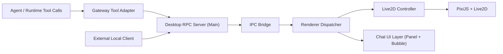

# Desktop Live2D 施工方案（重规划版）

## 1. 背景与当前缺口

当前 `desktop-live2d` 已完成 M1 基线能力：
- 单命令启动：`npm run desktop:up`
- 透明窗口 + Live2D 渲染
- 本地 WS JSON-RPC：`state.get` / `param.set` / `chat.show`
- Main <-> Renderer IPC 转发
- 基础配置文件：`~/yachiyo/config/desktop-live2d.json`

但与你要求相比，仍有三个核心缺口：
1. 缺少“聊天框面板”（当前只有气泡，缺少对话历史与输入区）。
2. 缺少“统一 RPC 消息传递链路”定义（请求、通知、事件流尚未标准化）。
3. 缺少“模型控制 Tool Calling 暴露层”（Agent 不能通过统一 tool 协议安全调用 Live2D 控制）。

本文件用于把上述缺口转成可实施、可测试、可验收的阶段方案。

## 2. 目标与边界

### 2.1 总目标（本轮）
- 构建桌面端完整交互闭环：`聊天框 + 气泡 + Live2D 控制`。
- 构建可扩展消息总线：`RPC 请求 + 事件通知 + IPC 转发`。
- 暴露 Agent 可用、受控、可审计的 Tool Calling 接口。
- 保持与主程序隔离：桌面子系统不直接依赖 runtime 内部对象。

### 2.2 非目标（本轮不做）
- 不做多模型并行渲染。
- 不做跨设备远程控制（仅本机 `127.0.0.1`）。
- 不做复杂动作编排器（高级优先级调度留到后续）。

## 3. 强约束

- 运行时禁止绝对路径加载模型。
- 模型运行目录固定：`assets/live2d/yachiyo-kaguya/`。
- 源目录仅用于导入，不参与运行时访问。
- RPC 服务仅监听 `127.0.0.1`。
- 所有 RPC 均需经过：
  - token 鉴权
  - 方法白名单
  - 参数 schema 校验
  - 限流
- Tool Calling 必须通过白名单暴露，禁止任意方法透传。

## 4. 目标架构（隔离优先）



### 4.1 进程职责

- Main 进程
  - 启停 orchestration（gateway、RPC、Electron 窗口）
  - RPC 接入层（鉴权、schema、限流、超时）
  - IPC 桥接与错误归一化
- Renderer 进程
  - Live2D 渲染与参数控制
  - 聊天框 UI（历史区、输入区、状态）
  - 对话气泡与动画层
- Gateway Tool Adapter
  - 将 runtime 的 tool call 规范映射到 desktop RPC
  - 工具白名单、参数转换、回包标准化

### 4.2 隔离策略

- `apps/desktop-live2d/*` 不 import `apps/runtime/*` 私有模块。
- runtime 与 desktop 通过协议通信，不共享内存对象。
- Renderer 不暴露 Node 能力，仅通过 preload bridge 调用受限 API。

## 5. 协议重构（RPC + 事件流）

### 5.1 传输层

- 传输：WebSocket + JSON-RPC 2.0
- 地址：`ws://127.0.0.1:<rpc_port>`
- 鉴权：`Authorization: Bearer <token>`（或 query token，后续可弃用）

### 5.2 方法分层

#### A. 状态查询
- `state.get`
  - 入参：`{}`
  - 出参：
    - `modelLoaded`
    - `modelName`
    - `bubbleVisible`
    - `chatPanelVisible`
    - `chatHistorySize`
    - `layout`

#### B. 对话显示层
- 兼容保留：`chat.show`（alias -> `chat.bubble.show`）
- 新增：
  - `chat.bubble.show`：单条气泡展示
  - `chat.panel.show`：打开聊天框
  - `chat.panel.hide`：隐藏聊天框
  - `chat.panel.append`：向聊天框追加消息
  - `chat.panel.clear`：清空聊天记录

`chat.panel.append` 入参草案：

```json
{
  "role": "user|assistant|system|tool",
  "text": "string",
  "timestamp": 1730000000000,
  "requestId": "optional-correlation-id"
}
```

#### C. 模型控制层
- 兼容保留：`param.set`（alias -> `model.param.set`）
- 新增：
  - `model.param.set`
  - `model.param.batchSet`
  - `model.motion.play`
  - `model.expression.set`

#### D. Tool Calling 暴露层
- `tool.list`：查询可用工具及 schema
- `tool.invoke`：按工具名执行（仅白名单）

`tool.invoke` 入参草案：

```json
{
  "name": "desktop_model_set_param",
  "arguments": {
    "name": "ParamAngleX",
    "value": 12
  },
  "traceId": "agent-trace-id"
}
```

### 5.3 错误码（统一）

- `-32600` invalid request
- `-32601` method not found
- `-32602` invalid params
- `-32001` unauthorized
- `-32002` rate limited
- `-32003` renderer timeout
- `-32004` model not loaded
- `-32005` internal error
- `-32006` tool not allowed
- `-32007` tool execution failed

### 5.4 事件通知（Server -> Client）

新增 JSON-RPC 通知（无 `id`）：
- `desktop.event`

事件 payload 统一：

```json
{
  "type": "chat.delta|chat.final|tool.call|tool.result|model.state",
  "traceId": "optional",
  "timestamp": 1730000000000,
  "data": {}
}
```

用途：
- 将 runtime 对话增量消息投递到聊天框。
- 将 tool 调用过程投递到 UI（用于调试/审计）。

## 6. 聊天框（Chat Panel）设计

### 6.1 UI 结构

- `ChatPanel`
  - Header：状态 + 展开/收起
  - MessageList：滚动历史
  - Composer：输入框 + 发送按钮
- `BubbleLayer`
  - 保持轻量即时反馈
  - 作为“短消息提示”而非历史承载

### 6.2 行为规则

- 聊天框默认不常驻，初始 `defaultVisible=false`。
- 点击 Live2D 角色触发聊天框显隐切换。
- 聊天框默认布局锚点为窗口左下，避免遮挡角色面部区域。
- 聊天框 Header 提供 `Hide` / `Close` 控制，且不影响 gateway 后台进程。
- 聊天框隐藏时窗口自动切换到紧凑尺寸（`window.compact*` 可配置）。
- Hide 后通过系统托盘图标可一键重新召唤桌宠窗口。
- `chat.panel.append` 追加到历史并自动滚动到底部。
- `chat.bubble.show` 不写历史（除非显式配置镜像）。
- 输入提交后触发 `chat.input.submit` IPC 事件（由 Main 决定是否转发到 gateway）。
- 历史队列可配上限（默认 200 条，超限丢弃最旧消息）。

### 6.3 配置扩展（`~/yachiyo/config/desktop-live2d.json`）

新增建议字段：

```json
{
  "chat": {
    "panel": {
      "enabled": true,
      "defaultVisible": false,
      "width": 320,
      "height": 220,
      "maxMessages": 200,
      "inputEnabled": true
    },
    "bubble": {
      "mirrorToPanel": false
    }
  }
}
```

## 7. Tool Calling 暴露策略

### 7.1 对 Agent 暴露的工具集（V2）

- `desktop_chat_show`
- `desktop_chat_panel_append`
- `desktop_model_set_param`
- `desktop_model_batch_set`
- `desktop_model_play_motion`
- `desktop_model_set_expression`

### 7.2 工具调用映射

- `desktop_model_set_param` -> `model.param.set`
- `desktop_model_batch_set` -> `model.param.batchSet`
- `desktop_model_play_motion` -> `model.motion.play`
- `desktop_model_set_expression` -> `model.expression.set`

### 7.3 安全与治理

- 工具名白名单 + 参数 schema 双校验
- 每工具独立限流
- traceId 全链路透传
- 结构化审计日志：`tool_name`、`args_hash`、`latency_ms`、`result`

## 8. 分阶段执行计划（详细）

### Phase A：协议冻结与骨架升级

交付：
- 扩展 RPC 方法表与 schema（新增 chat panel/model/tool 调用方法）
- 新增 `desktop.event` 通知管道
- `tool.list/tool.invoke` 骨架（先返回占位）

测试：
- `rpcValidator` 新方法 schema 全覆盖
- `rpcServer` 通知发送与错误码回包测试
- 限流规则按方法分桶测试

文档与留痕：
- 更新施工方案 + README
- 更新 `PROGRESS_TODO.md` 阶段状态
- 提交 commit（phase A）

### Phase B：聊天框 UI 闭环

交付：
- Renderer 新增 ChatPanel（历史、输入、显隐）
- 新增 IPC：`chat.input.submit`（renderer -> main）
- `chat.panel.*` 方法可用

测试：
- Renderer 纯函数/状态机测试（历史截断、显隐、追加）
- IPC bridge 测试（submit 事件透传）
- RPC 到 UI 端到端集成测试

文档与留痕：
- 补充聊天框交互说明与配置字段
- 更新阶段进度
- 提交 commit（phase B）

### Phase C：RPC 消息传递与网关转发

交付：
- Main 新增 runtime 消息订阅与 desktop 事件桥接
- 对话增量消息可从 runtime 推到聊天框
- `runtime.final` 与 UI 状态对齐

测试：
- 网关事件转发单测（start/event/final）
- 断线重连与消息丢失保护测试
- 压测：高频 `chat.panel.append` 不阻塞渲染

文档与留痕：
- 更新消息时序图与异常处理章节
- 更新进度登记
- 提交 commit（phase C）

### Phase D：Tool Calling 暴露与模型控制

交付：
- Gateway Tool Adapter：tool -> desktop RPC 映射
- `tool.list` 返回动态能力
- `tool.invoke` 打通到模型控制方法
- `model.motion.play` / `model.expression.set` 最小可用

测试：
- tool adapter 映射和拒绝路径测试
- `tool.invoke` 参数错误/白名单拦截测试
- 从 runtime 发 tool call 到模型动作的集成测试

文档与留痕：
- 更新 tools 契约文档（参数、错误、示例）
- 更新进度登记
- 提交 commit（phase D）

### Phase E：稳定性与发布前收敛

交付：
- 性能优化（节流、批处理、重绘最小化）
- 可观测性补全（traceId、latency、errorCode）
- 回归脚本与 smoke checklist 固化

测试：
- 全量自动化回归（`npm test`）
- 手工 smoke（窗口、拖拽、清晰度、聊天框、tool calling）
- 30 分钟稳定性测试（内存/GPU/消息吞吐）

文档与留痕：
- 最终验收报告
- 更新 `README` 使用章节
- 提交 commit（phase E）

### Phase F：会话联动与跨端同步

交付：
- Desktop 启动即创建并启用新的 `desktop-*` session。
- 聊天输入支持 `/new` 命令：创建新会话并切换上下文。
- 网页端定时同步 `/api/sessions` 与会话详情，实现桌面消息/回复可见。
- 网页端默认“跟随最新服务端会话”；手动点选后退出自动跟随。

测试：
- `gatewayRuntimeClient` 新增会话 ID、会话创建、settings bootstrap 单测。
- `desktopSuite` `/new` 命令识别单测。
- 全量回归：`npm test`。

文档与留痕：
- 更新施工方案会话同步章节与阶段状态。
- 更新 `README` 桌面命令与同步说明。
- 更新 `PROGRESS_TODO.md` 需求登记和阶段日志。
- 提交 commit（phase F）

## 9. 测试矩阵（按能力维度）

- 协议层
  - 方法白名单
  - schema 校验
  - 错误码一致性
- 链路层
  - RPC -> IPC -> Renderer 成功/超时/失败
  - runtime 事件 -> desktop.event -> UI
- UI 层
  - 聊天框消息列表与输入交互
  - 气泡显示与自动消失
  - 模型缩放/清晰度/位置配置生效
- 工具层
  - tool.list/tool.invoke 契约
  - 映射正确性与拒绝路径
  - 审计日志完整性

## 10. 当前阶段状态（重规划后）

- 已完成
  - M1 基线：模型渲染、透明气泡、基础 RPC、配置文件、右下角放置、拖拽
  - Phase A：协议冻结与文档同步
  - Phase B：聊天框 UI（历史/输入/显隐）+ `chat.panel.*` RPC + `chat.input.submit` IPC
  - Phase C：runtime 事件转发（gateway runtime notification -> `desktop.event` -> renderer `runtime.final` 对齐）
  - Phase D：tool-calling 暴露（`tool.list` / `tool.invoke`）+ `model.*` 最小控制能力
  - Phase F：启动新会话 + `/new` 切换会话 + 网页会话消息同步 + 点击角色弹框/避脸布局
- 进行中
  - Phase E：稳定性收敛（自动化 smoke 已接入，点击闪烁修复已并入，待手工发布验收）
- 未开始
  - 无

## 11. 阶段完成定义（DoD）

每个阶段完成必须同时满足：
1. 代码实现完成，且对应新增测试通过。
2. `PROGRESS_TODO.md` 更新阶段状态与变更日志。
3. 本施工方案中对应章节同步更新。
4. 形成独立 commit 留痕（可追溯到阶段目标）。
