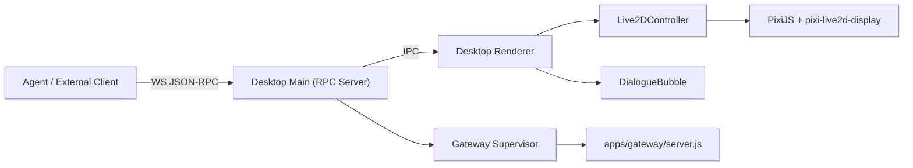

# Desktop Live2D 施工方案（详细版）

## 1. 目标与边界

### 1.1 目标（V1）
- 单命令启动整套系统：`npm run desktop:up`。
- Live2D 小人在桌面窗口可稳定渲染。
- 提供可控 RPC：`state.get`、`param.set`、`chat.show`，并具备标准错误回包。
- 对话消息通过透明气泡展示，支持自动消失与覆盖更新。
- 桌宠系统与主程序隔离：仅通过本地协议通信，不共享内部对象。

### 1.2 非目标（V1 不做）
- 不做多角色同时渲染。
- 不做完整动作编排器（仅预留接口）。
- 不接入系统级权限能力（文件读写、shell 执行等）。

## 2. 关键约束（必须满足）

- 运行时禁止绝对路径加载模型。
- 模型源目录仅用于导入，不参与运行时读取：
  - `/Users/doosam/Documents/Programming/yachiyo-desktop/【雪熊企划】八千代辉夜姬`
- 运行时模型目录固定为：
  - `assets/live2d/yachiyo-kaguya/`
- RPC 服务仅监听 `127.0.0.1`。
- 所有 RPC 必须经过：
  - token 鉴权
  - 方法白名单
  - 参数 schema 校验
  - 速率限制

## 3. 系统总体架构



### 3.1 进程职责
- Main 进程：
  - 统一编排：gateway、RPC server、desktop 窗口生命周期。
  - 处理外部 RPC、鉴权与参数校验。
  - 将合法请求转发至 renderer 并回收结果。
- Renderer 进程：
  - 初始化 Pixi 与 Live2D 模型。
  - 处理来自 main 的控制指令。
  - 绘制与管理对话气泡。

### 3.2 隔离设计
- Live2D 新逻辑全部放在 `apps/desktop-live2d/` 下。
- 不直接 import `apps/runtime/*` 私有模块。
- Main 与 Renderer 仅通过固定 IPC Channel 通信。
- 不共享 session、memory、runtime 内部对象。

## 4. 目录与模块拆分（建议落地结构）

```text
apps/
  desktop-live2d/
    main/
      desktopSuite.js          # startDesktopSuite/stopDesktopSuite
      gatewaySupervisor.js     # 内置或外置 gateway 模式
      rpcServer.js             # WS JSON-RPC server
      rpcValidator.js          # method 白名单 + Ajv schema
      rpcRateLimiter.js        # 按 method 限流
      ipcBridge.js             # main <-> renderer 转发
      config.js                # 端口/token/路径配置
    renderer/
      index.html
      bootstrap.js             # Pixi/DOM 初始化
      live2dController.js      # loadModel/playMotion/setParam/getState
      bubbleLayer.js           # 透明气泡渲染与生命周期
      rpcDispatcher.js         # renderer 内 method 分派
scripts/
  desktop-up.js                # npm run desktop:up 入口
  live2d-import.js             # npm run live2d:import
assets/
  live2d/
    yachiyo-kaguya/            # 运行时唯一模型目录
```

## 5. 统一启动方案（`desktop:up`）

### 5.1 启动契约
- CLI：`npm run desktop:up`
- API：`startDesktopSuite(options)`
- 返回：

```js
{
  gatewayUrl: "http://127.0.0.1:3000",
  rpcUrl: "ws://127.0.0.1:17373",
  token: "<runtime-token>",
  stop: async () => {}
}
```

### 5.2 启动顺序（严格顺序）
1. 读取配置（端口、token、gateway 模式、模型目录）。
2. 校验模型资源目录：`assets/live2d/yachiyo-kaguya/` 必须存在且完整。
3. 启动或复用 gateway。
4. 启动 RPC Server（仅 127.0.0.1）。
5. 创建 Electron 窗口并注入 preload。
6. Renderer 完成模型初始化，向 main 报 ready。
7. 输出启动摘要日志（gatewayUrl/rpcUrl/pid）。

### 5.3 关闭顺序
1. 停止 RPC 新请求接入。
2. 通知 renderer 执行清理。
3. 关闭窗口。
4. 关闭内置 gateway（外部 gateway 不处理）。
5. 输出关闭摘要。

## 6. 模型导入与资产管理（禁止绝对路径运行）

### 6.1 导入命令
- `npm run live2d:import`

### 6.2 导入行为
1. 从源目录拷贝到 `assets/live2d/yachiyo-kaguya/`。
2. 拷贝后生成 `assets/live2d/yachiyo-kaguya/manifest.json`：
   - 文件列表
   - 文件大小
   - 修改时间
3. 校验 `model3.json` 的 FileReferences：
   - moc3 存在
   - textures 全部存在
   - physics/cdi 可选但若声明必须存在
4. 导入失败时返回明确错误并退出非 0。

### 6.3 运行时加载策略
- 仅允许读取 `assets/live2d/yachiyo-kaguya/八千代辉夜姬.model3.json`。
- 不接受 `LIVE2D_MODEL_DIR=/abs/path` 这类运行时输入。
- 若资源缺失，`desktop:up` 启动失败并提示先执行 `live2d:import`。

## 7. RPC 协议详细定义（V1）

### 7.1 传输与鉴权
- 传输：WebSocket + JSON-RPC 2.0。
- 地址：`ws://127.0.0.1:<rpc_port>`。
- 鉴权：
  - 连接时携带 `Authorization: Bearer <token>` 或 query token。
  - 鉴权失败立即断开连接。

### 7.2 方法清单（M0 冻结）
- `state.get`
  - 入参：`{}`
  - 出参：`{ modelLoaded, modelName, fps, bubbleVisible }`
- `param.set`
  - 入参：`{ name: string, value: number }`
  - 出参：`{ ok: true }`
- `chat.show`
  - 入参：`{ text: string, durationMs?: number, mood?: string }`
  - 出参：`{ ok: true, expiresAt: number }`

### 7.3 预留方法（M2/M3）
- `param.batchSet`
- `motion.play`
- `expression.set`
- 在 M1 阶段调用上述方法时，统一返回 `-32601 method not found`。

### 7.4 错误码
- `-32600` invalid request
- `-32601` method not found
- `-32602` invalid params
- `-32001` unauthorized
- `-32002` rate limited
- `-32003` renderer timeout
- `-32004` model not loaded
- `-32005` internal error

### 7.5 限流策略（默认）
- `state.get`: 30 req/s/connection
- `param.set`: 60 req/s/connection
- `chat.show`: 10 req/s/connection
- 超限返回 `-32002`，不关闭连接。

## 8. IPC 协议（Main <-> Renderer）

### 8.1 Channel 约定
- `live2d:rpc:invoke`：main -> renderer
- `live2d:rpc:result`：renderer -> main
- `live2d:renderer:ready`：renderer -> main
- `live2d:renderer:error`：renderer -> main

### 8.2 Payload 结构

```json
{
  "requestId": "uuid",
  "method": "chat.show",
  "params": { "text": "..." },
  "deadlineMs": 3000
}
```

- renderer 必须在 `deadlineMs` 内回包；超时由 main 返回 `-32003`。

## 9. Renderer 实现细节

### 9.1 Live2DController
- `loadModel(modelJsonPath)`
- `setParam(name, value)`
- `batchSetParams(updates)`
- `getState()`
- 内部状态：
  - `uninitialized`
  - `loading`
  - `ready`
  - `error`

### 9.2 气泡层（BubbleLayer）
- DOM Overlay 叠在 canvas 上。
- API：
  - `show({ text, durationMs, mood })`
  - `hide()`
  - `getState()`
- 行为：
  - 新消息抢占旧消息并重置计时。
  - 200ms fade in/out。
  - 长文本自动换行，最大宽度限制。

### 9.3 性能约束
- 参数更新内部节流到 60Hz。
- 合并同一帧重复 `param.set`。
- 对气泡重绘做最小化 DOM 更新。

## 10. 可观测性与故障定位

### 10.1 日志字段
- `timestamp`
- `module`
- `event`
- `requestId`
- `method`
- `latencyMs`
- `errorCode`

### 10.2 关键日志事件
- `desktop_up_start`
- `model_import_check_passed`
- `gateway_started` / `gateway_external`
- `rpc_server_started`
- `renderer_ready`
- `rpc_invoke` / `rpc_result` / `rpc_error`
- `desktop_up_failed`

## 11. 测试计划（可执行）

### 11.1 单元测试
- `live2d-import`：
  - 正常拷贝
  - 缺失 model3/moc3/textures 报错
- `rpcValidator`：
  - 非白名单方法拒绝
  - 参数 schema 拒绝
- `rpcRateLimiter`：
  - 超限返回 `-32002`
- `ipcBridge`：
  - renderer 超时返回 `-32003`

### 11.2 集成测试
- `desktop:up` 成功启动，返回 rpcUrl/gatewayUrl。
- `state.get` 成功返回模型状态。
- `chat.show` 成功触发并能被状态读到可见中。
- 关闭流程能释放 RPC 端口和子进程。

### 11.3 人工验收
- 窗口透明、可拖动、可正常关闭。
- 气泡在模型上方显示且动画自然。
- 连续发送 20 条 `chat.show` 不出现卡死或丢回包。

## 12. 里程碑与交付物

### M1（最小闭环，预计 2-3 天）
- 交付：
  - `live2d-import`
  - `desktop:up`
  - `state.get`、`param.set`、`chat.show`
  - 基础测试与日志

### M2（控制能力增强，预计 2-4 天）
- 交付：
  - `param.batchSet`
  - 动作/表情方法占位 + 状态机
  - 并发与限流完善

### M3（稳定性与产品化，预计 3-5 天）
- 交付：
  - `motion.play`/`expression.set` 实装
  - 配置页
  - 打包路径校验与回归

## 13. M0 冻结决策（已确认并生效）

- RPC 端口策略：
  - 默认固定端口 `17373`。
  - 允许通过环境变量 `DESKTOP_LIVE2D_RPC_PORT` 覆盖（仅开发调试用途）。
- token 策略：
  - 默认启动时随机生成。
  - 若提供 `DESKTOP_LIVE2D_RPC_TOKEN` 则优先使用。
  - 启动后写入运行时摘要（用于本机调试读取）。
- `live2d:import` 覆盖策略：
  - 默认允许覆盖目标目录。
  - 覆盖前自动备份到 `data/backups/live2d/<timestamp>/`。
- V1 方法范围（严格冻结）：
  - 只保证 `state.get`、`param.set`、`chat.show` 三个方法完成并验收。
  - `param.batchSet`、`motion.play`、`expression.set` 保留到后续里程碑。

## 14. 阶段执行进度

- M0（DONE）：
  - 已冻结端口/token/导入覆盖策略/V1 方法范围，并完成文档固化。
- M1（DONE）：
  - 已实现：`live2d:import`、`desktop:up`、RPC 服务、IPC 转发、基础渲染与透明气泡。
  - 已完成自动化测试（含新增 desktop-live2d 用例）。
  - 已完成 GUI 冒烟：启动成功并验证 `state.get`、`chat.show` RPC 回包。
