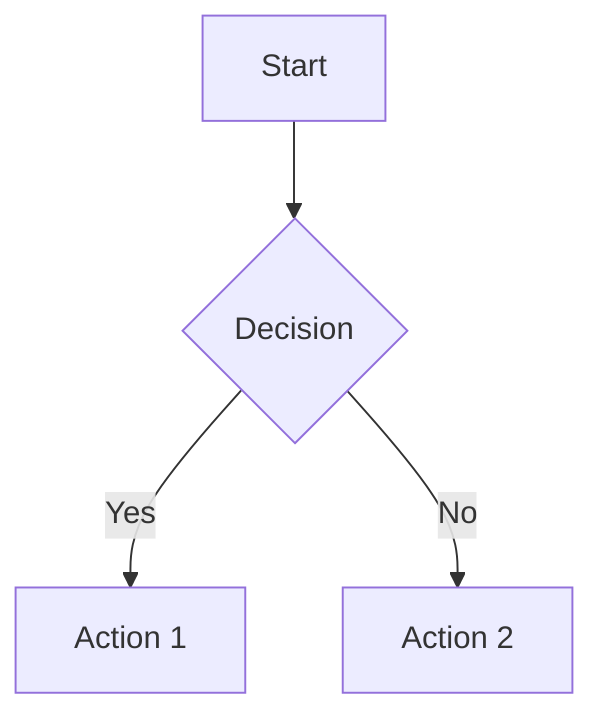
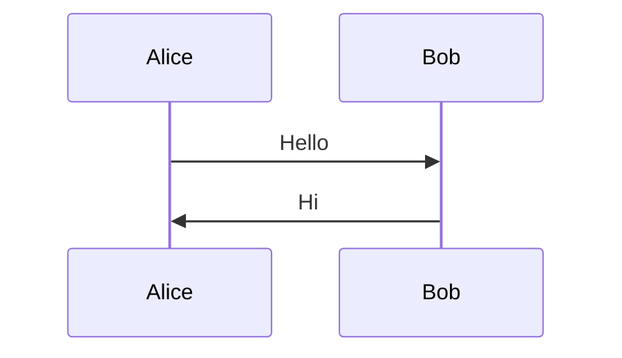
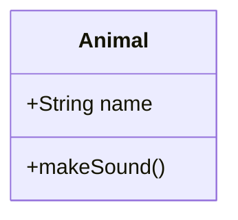
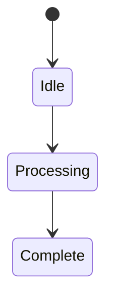
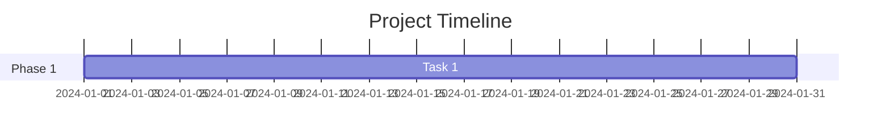
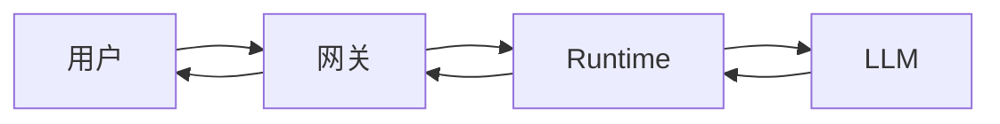

# 桌面端Markdown和Mermaid渲染功能文档

## 概述

本文档描述桌面端对话框（Desktop Chat Panel）和气泡（Bubble）的Markdown、LaTeX公式和Mermaid流程图渲染功能，以及气泡消息智能截断功能。

## 功能特性

### 1. ChatPanel Markdown渲染

桌面端聊天面板支持完整的Markdown渲染，包括：

- **基础格式**：粗体、斜体、代码、链接
- **标题**：H1-H6
- **列表**：有序列表、无序列表
- **代码块**：带语法高亮
- **表格**：完整的Markdown表格支持
- **引用块**：blockquote
- **分隔线**：horizontal rule

### 2. LaTeX公式渲染

支持使用KaTeX渲染LaTeX数学公式：

**行内公式**：
```
$E = mc^2$
```
渲染为：$E = mc^2$

**块级公式**：
```
$$\int_{-\infty}^{\infty} e^{-x^2} dx = \sqrt{\pi}$$
```
渲染为：
$$\int_{-\infty}^{\infty} e^{-x^2} dx = \sqrt{\pi}$$

**支持的LaTeX功能**：
- 希腊字母：$\alpha, \beta, \gamma, \delta$
- 分数：$\frac{a}{b}$
- 根号：$\sqrt{x}$, $\sqrt[3]{8}$
- 求和：$\sum_{i=1}^{n} x_i$
- 积分：$\int_0^\infty f(x) dx$
- 矩阵：$\begin{pmatrix} a & b \\ c & d \end{pmatrix}$
- 上下标：$x^2$, $x_i$, $x_i^2$

### 3. Mermaid流程图渲染

ChatPanel支持渲染Mermaid流程图，包括：

**流程图（Flowchart）**：
````markdown

````

**时序图（Sequence Diagram）**：
````markdown

````

**类图（Class Diagram）**：
````markdown

````

**状态图（State Diagram）**：
````markdown

````

**甘特图（Gantt Chart）**：
````markdown

````

### 4. Bubble智能截断

气泡消息支持智能截断，避免显示过长内容：

#### 截断模式

**Simple模式**：
- 直接按字符数截断
- 不考虑语法完整性
- 性能最好

**Smart模式（推荐）**：
- 保持单词边界
- 避免在LaTeX公式中间截断
- 检测未闭合的Markdown语法
- 智能选择截断点

**Disabled模式**：
- 完全禁用截断
- 显示完整消息

#### 复杂内容处理

当消息包含以下复杂内容时，可以选择显示提示而非截断：

- Mermaid代码块（\`\`\`mermaid）
- LaTeX块级公式（$$...$$）
- Markdown表格（|...|）

提示消息：`📊 内容包含图表或公式，请查看聊天面板`

## 配置说明

### 配置文件位置

桌面端配置文件：`~/yachiyo/config/desktop-live2d.json`

### 配置结构

```json
{
  "chat": {
    "bubble": {
      "truncate": {
        "enabled": true,
        "maxLength": 120,
        "mode": "smart",
        "suffix": "...",
        "showHintForComplex": true
      }
    }
  }
}
```

### 配置项说明

| 配置项 | 类型 | 默认值 | 说明 |
|--------|------|--------|------|
| `enabled` | boolean | true | 是否启用截断 |
| `maxLength` | number | 120 | 最大字符数（50-500） |
| `mode` | string | 'smart' | 截断模式：'simple' \| 'smart' \| 'disabled' |
| `suffix` | string | '...' | 截断后缀 |
| `showHintForComplex` | boolean | true | 复杂内容显示提示 |

### 通过WebUI配置

1. 访问 `http://localhost:3000/config-v2.html`
2. 滚动到"桌面气泡设置"区域
3. 调整配置选项
4. 点击"保存气泡配置"
5. 按照提示手动编辑配置文件

**注意**：由于桌面配置文件的安全性考虑，WebUI只能显示配置建议，需要手动编辑配置文件。

## 使用示例

### 示例1：发送带公式的消息

```
计算圆的面积公式是 $A = \pi r^2$，其中 $r$ 是半径。

对于半径为5的圆：
$$A = \pi \times 5^2 = 25\pi \approx 78.54$$
```

### 示例2：发送流程图

````
系统架构如下：


````

### 示例3：发送表格

```
| 功能 | ChatPanel | Bubble |
|------|-----------|--------|
| Markdown | ✅ | ✅ (inline) |
| LaTeX | ✅ | ✅ (inline) |
| Mermaid | ✅ | ❌ |
| 截断 | ❌ | ✅ |
```

## 技术实现

### 渲染流程

1. **接收消息** → 从Main进程接收消息数据
2. **LaTeX渲染** → 使用KaTeX渲染公式
3. **Markdown渲染** → 使用marked.js渲染Markdown
4. **Mermaid渲染** → 使用mermaid.js渲染流程图
5. **DOM更新** → 更新聊天面板显示

### 截断流程

1. **检测复杂内容** → 使用正则表达式检测
2. **选择处理方式** → 显示提示或执行截断
3. **智能截断** → 保持语法完整性
4. **渲染输出** → 渲染截断后的内容

### 字符计数

使用`Array.from(text).length`正确处理：
- Emoji字符（如😀）
- 多字节字符（如中文）
- 组合字符

## 性能考虑

### 渲染性能

- **Markdown渲染**：同步，性能良好
- **LaTeX渲染**：同步，轻量级
- **Mermaid渲染**：异步，较重

### 优化建议

1. **限制消息数量**：ChatPanel默认最多200条消息
2. **避免过多图表**：单个消息中避免超过3个Mermaid图表
3. **使用截断**：气泡启用智能截断减少渲染负担

## 故障排除

### 问题1：Mermaid图表不显示

**可能原因**：
- 网络问题，CDN加载失败
- Mermaid语法错误

**解决方案**：
- 检查网络连接
- 验证Mermaid语法
- 查看浏览器控制台错误信息

### 问题2：LaTeX公式渲染错误

**可能原因**：
- LaTeX语法错误
- 未闭合的$符号

**解决方案**：
- 检查公式语法
- 确保$符号成对出现
- 使用$$...$$包裹复杂公式

### 问题3：气泡截断不生效

**可能原因**：
- 配置未正确加载
- mode设置为'disabled'

**解决方案**：
- 检查配置文件格式
- 确认enabled=true
- 重启桌面程序

## 测试覆盖

### 单元测试

- `test/desktop-live2d/markdownRendering.test.js`：Markdown渲染测试
- `test/desktop-live2d/bubbleTruncate.test.js`：截断功能测试
- `test/gateway/mermaidRendering.test.js`：Mermaid渲染测试

### 测试命令

```bash
# 运行所有测试
npm test

# 运行特定测试
npm test -- test/desktop-live2d/bubbleTruncate.test.js
```

### 测试覆盖率

- 配置加载：100%
- 截断逻辑：100%
- 复杂内容检测：100%
- 字符计数：100%

## 更新日志

### v1.0.0 (2026-03-02)

- ✅ 添加ChatPanel Markdown渲染支持
- ✅ 添加ChatPanel LaTeX公式渲染
- ✅ 添加ChatPanel Mermaid流程图渲染
- ✅ 添加Bubble智能截断功能
- ✅ 添加配置UI界面
- ✅ 编写完整测试用例（359个测试全部通过）

## 相关文档

- [Desktop Live2D施工方案](./DESKTOP_LIVE2D_CONSTRUCTION_PLAN.md)
- [Bubble流式输出施工计划](./BUBBLE_STREAMING_CONSTRUCTION_PLAN.md)
- [Marked.js文档](https://marked.js.org/)
- [KaTeX文档](https://katex.org/)
- [Mermaid文档](https://mermaid.js.org/)

## 贡献者

- Claude Sonnet 4.6
- 项目维护者

---

**最后更新**：2026-03-02
