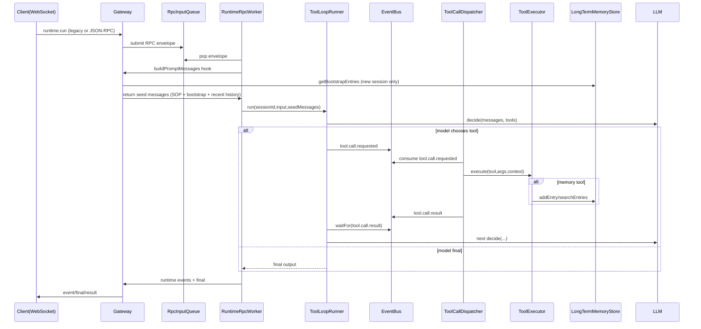

# Tool-Driven Long-Term Memory: Implementation Record

## 1. Scope

This document records the full implementation of the long-term memory upgrade completed in this iteration.

Core objective:
- Decouple long-term memory lifecycle from runtime finalization hooks.
- Let the model manage durable memory through tool-calls (`memory_write`, `memory_search`).
- Inject memory SOP + bootstrap memory entries when a new session starts.
- Keep the memory policy easy to modify by editing a markdown SOP file.

---

## 2. Architectural Change Summary

### Before
- Memory was primarily session-bound and refreshed after run finalization.
- Retrieval context was assembled automatically from persisted session history.

### After
- Long-term memory is a dedicated global store (`~/yachiyo/data/long-term-memory/memory.json` by default).
- Model writes/searches long-term memory only via tools:
  - `memory_write`
  - `memory_search`
- New session bootstrap injects:
  1. memory SOP markdown
  2. top N long-term memory entries
- Runtime stays decoupled:
  - queue -> rpc worker -> loop runner
  - tool execution remains event-bus driven
  - memory logic sits behind tools/store, not inside loop runner branching

---

## 3. End-to-End Runtime Flow



---

## 4. Module-by-Module Implementation

## 4.1 `apps/gateway/server.js`

Responsibilities:
- Build runtime graph (`EventBus`, `RpcInputQueue`, `RuntimeRpcWorker`, `ToolLoopRunner`, `ToolCallDispatcher`).
- Build tool registry with memory store dependency injection.
- Inject memory SOP/bootstrap at session start.
- Persist session messages/events/runs.
- Expose memory APIs.

Key changes:
1. Tool registry construction changed from static import to factory:
   - Uses `createLocalTools({ memoryStore })`.
2. Long-term memory store added:
   - `new LongTermMemoryStore()`.
3. New session prompt bootstrap in `buildPromptMessages`:
   - Detects session start (`no session` or `messages.length === 0`).
   - Loads SOP via `loadMemorySop`.
   - Reads top memory entries via `longTermMemoryStore.getBootstrapEntries`.
   - Emits both as `system` seed messages.
4. Keeps short-term context injection:
   - `buildRecentContextMessages(...)`.
5. Memory APIs:
   - `GET /api/memory`
   - `GET /api/memory/search?q=<keyword>`

Call points:
- `enqueueRpc(...).context.buildPromptMessages` is the integration seam.
- `enqueueRpc(...).onRunStart/onRuntimeEvent/onRunFinal` remain session persistence hooks.

---

## 4.2 `apps/runtime/rpc/runtimeRpcWorker.js`

Responsibilities:
- Sole queue consumer.
- JSON-RPC method router.
- Runtime hook orchestrator.

How memory-related integration works:
- Calls `context.buildPromptMessages({session_id,input,...})`.
- Receives seed messages and forwards to loop runner:
  - `runner.run({ sessionId, input, seedMessages, onEvent })`.

Why this matters:
- Memory context is decoupled from runner internals.
- Gateway can evolve context policy without changing RPC worker method semantics.

---

## 4.3 `apps/runtime/loop/toolLoopRunner.js`

Responsibilities:
- Iterative planning loop against LLM.
- Emit runtime events.
- Trigger tool calls through event bus.

Memory-relevant updates:
- Accepts `system/user/assistant` in `seedMessages`.
- Base system prompt explicitly reminds model:
  - memory operations must use tools (`memory_write` / `memory_search`).

Tool-call path remains unchanged:
- `tool.call.requested` publish
- wait `tool.call.result`
- append `assistant tool_call` + `tool result` messages
- continue planning

---

## 4.4 `apps/runtime/orchestrator/toolCallDispatcher.js`

Responsibilities:
- EventBus subscriber for `tool.call.requested`.
- Executes tool and publishes `tool.call.result`.

Update:
- Passes execution context to executor:
  - `trace_id`, `session_id`, `step_index`, `call_id`.

Purpose:
- Memory write tool can store source metadata.

---

## 4.5 `apps/runtime/executor/toolExecutor.js`

Responsibilities:
- Resolve tool by name from registry.
- Execute tool and normalize result/error.

Update:
- Signature upgraded to:
  - `execute(toolCall, executionContext = {})`
- Context forwarded to each tool implementation.

---

## 4.6 `apps/runtime/executor/localTools.js`

Responsibilities:
- Defines all local tools and schemas.

New design:
- Added factory function:
  - `createLocalTools({ memoryStore })`
- Backward-compatible default export kept:
  - `module.exports = createLocalTools()`

New tools:
1. `memory_write`
   - Input:
     - `content: string` (required)
     - `keywords: string[]` (optional)
   - Behavior:
     - persists durable memory entry via `memoryStore.addEntry`
     - merges metadata from execution context (`session_id`, `trace_id`, `step_index`)
   - Output:
     - JSON string with `ok`, `id`, `content`, `keywords`

2. `memory_search`
   - Input:
     - `query: string` (required)
     - `limit: number` (optional, bounded)
   - Behavior:
     - calls `memoryStore.searchEntries`
   - Output:
     - JSON string with `ok`, `total`, `items`

---

## 4.7 `apps/runtime/session/longTermMemoryStore.js`

Responsibilities:
- Durable global memory storage.
- Add/list/search/bootstrap operations.
- Deduplication and ranking.

Storage format:
- File: `<LONG_TERM_MEMORY_DIR>/memory.json`
- Shape:
  - `version`
  - `updated_at`
  - `entries[]`

Entry schema:
- `id`
- `content`
- `keywords[]`
- `source_session_id`
- `source_trace_id`
- `metadata`
- `created_at`
- `updated_at`

Core methods:
1. `addEntry({...})`
   - Validates non-empty content.
   - Clips content by `maxContentChars`.
   - Normalizes keywords.
   - Dedupes by lowercased content (merge keywords/metadata/update timestamp).
2. `listEntries({limit,offset})`
   - Returns latest-first list.
3. `searchEntries({query,limit,minScore,maxChars})`
   - Tokenizes query/content/keywords.
   - Score = token overlap count.
   - Ranks by score then updated_at.
   - Applies char budget + topK.
4. `getBootstrapEntries({limit,maxChars})`
   - Returns recent entries to inject on new session.

Concurrency:
- Uses in-process promise lock (`withLock`) for serialized writes.
- Atomic file replace (`tmp -> rename`) for safe persistence.

---

## 4.8 `apps/runtime/session/memorySopLoader.js`

Responsibilities:
- Load editable markdown SOP text.
- Clip to max size.
- Fail-safe return empty string when file missing/unreadable.

Default SOP path:
- `docs/memory_sop.md`

Override:
- `MEMORY_SOP_PATH`

---

## 4.9 `docs/memory_sop.md`

Purpose:
- Declarative policy for model memory behavior.
- Easy to modify without touching runtime code.

Current sections:
- Goal
- Write policy
- Search policy
- Quality rules

How it is used:
- Injected as `system` prompt only at session start.

---

## 5. API / Calling Methods

## 5.1 Runtime Calls

### Legacy WebSocket
```json
{ "type": "run", "session_id": "s-1", "input": "记住我喜欢蓝色" }
```

### JSON-RPC 2.0
```json
{
  "jsonrpc": "2.0",
  "id": "req-1",
  "method": "runtime.run",
  "params": {
    "session_id": "s-1",
    "input": "请以后记住我的偏好"
  }
}
```

---

## 5.2 Memory Management APIs

### List memory entries
```bash
curl "http://localhost:3000/api/memory?limit=20&offset=0"
```

### Search memory entries
```bash
curl "http://localhost:3000/api/memory/search?q=blue&limit=5"
```

### Session APIs (existing)
```bash
curl "http://localhost:3000/api/sessions"
curl "http://localhost:3000/api/sessions/<session_id>"
curl "http://localhost:3000/api/sessions/<session_id>/events"
```

---

## 5.3 Tool Call Contract (Model-facing)

### `memory_write`

Input:
```json
{
  "content": "user favorite color is blue",
  "keywords": ["favorite", "color", "blue"]
}
```

Result (tool text payload):
```json
{
  "ok": true,
  "id": "mem-...",
  "content": "user favorite color is blue",
  "keywords": ["favorite", "color", "blue"]
}
```

### `memory_search`

Input:
```json
{
  "query": "favorite color blue",
  "limit": 3
}
```

Result:
```json
{
  "ok": true,
  "total": 1,
  "items": [
    {
      "id": "mem-...",
      "content": "user favorite color is blue",
      "keywords": ["favorite", "color", "blue"],
      "updated_at": "..."
    }
  ]
}
```

---

## 6. Config Matrix

Memory/Bootstrap/SOP related:
- `LONG_TERM_MEMORY_DIR`:
  - default `~/yachiyo/data/long-term-memory`
  - location of `memory.json`
- `MEMORY_BOOTSTRAP_MAX_ENTRIES`:
  - default `10`
  - max number of entries injected on new session
- `MEMORY_BOOTSTRAP_MAX_CHARS`:
  - default `2400`
  - total char budget for bootstrap entries
- `MEMORY_SOP_PATH`:
  - default `docs/memory_sop.md`
  - markdown SOP path
- `MEMORY_SOP_MAX_CHARS`:
  - default `8000`
  - SOP injection char budget

Existing short-term context knobs (still active):
- `CONTEXT_MAX_MESSAGES`
- `CONTEXT_MAX_CHARS`

---

## 7. Test Coverage Map

New/updated tests:
- `test/runtime/longTermMemoryStore.test.js`
  - add/search/list/bootstrap behavior
  - dedupe behavior
- `test/runtime/memoryTools.test.js`
  - model-facing tools integration
- `test/runtime/memorySopLoader.test.js`
  - SOP loading + clipping
- `test/integration/gateway.e2e.test.js`
  - end-to-end memory write via tool
  - search via tool
  - new session SOP + bootstrap injection validation
  - memory API validation

Execution commands:
```bash
npm test
npm run test:ci
```

---

## 8. Manual Validation SOP

1. Start runtime:
```bash
npm run dev
```

2. In a session, ask model to remember a durable fact:
- Example intent: "请记住我最喜欢的颜色是蓝色，以后回答时优先考虑。"
- Expected: model may call `memory_write`.

3. Start a brand-new session:
- Ask: "你知道我喜欢什么颜色吗？如果知道请先查长期记忆。"
- Expected:
  - new session prompt includes SOP + bootstrap entries
  - model can call `memory_search`
  - answer references stored memory

4. Verify API:
```bash
curl "http://localhost:3000/api/memory"
curl "http://localhost:3000/api/memory/search?q=蓝色"
```

---

## 9. Extensibility Guide

## 9.1 Change memory policy quickly
- Edit `docs/memory_sop.md`.
- No code change required.

## 9.2 Change retrieval ranking
- Modify `LongTermMemoryStore.scoreEntry(...)`.
- Optionally add hybrid vector ranking later.

## 9.3 Add stricter write guardrails
- Add logic in `memory_write` tool before `addEntry`.
- Example: deny short/low-information entries; deny secrets by regex.

## 9.4 Add multi-tenant memory namespace
- Extend entry schema with `tenant_id` / `user_id`.
- Filter in `list/search/bootstrap`.

---

## 10. Known Constraints

- Retrieval is lexical token overlap baseline, not embedding/vector yet.
- Write quality depends on model behavior + SOP adherence.
- File store is process-local and suitable for single-node deployment.
- `GET /api/sessions/:sessionId/memory` is compatibility field from session store, not authoritative long-term memory source.

---

## 11. Changed Files (Feature-Relevant)

- `apps/gateway/server.js`
- `apps/runtime/executor/localTools.js`
- `apps/runtime/executor/toolExecutor.js`
- `apps/runtime/orchestrator/toolCallDispatcher.js`
- `apps/runtime/loop/toolLoopRunner.js`
- `apps/runtime/session/longTermMemoryStore.js`
- `apps/runtime/session/memorySopLoader.js`
- `docs/memory_sop.md`
- `test/runtime/longTermMemoryStore.test.js`
- `test/runtime/memoryTools.test.js`
- `test/runtime/memorySopLoader.test.js`
- `test/integration/gateway.e2e.test.js`
